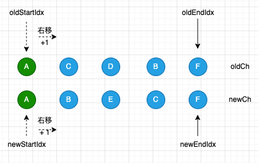
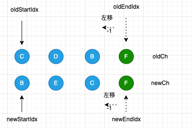
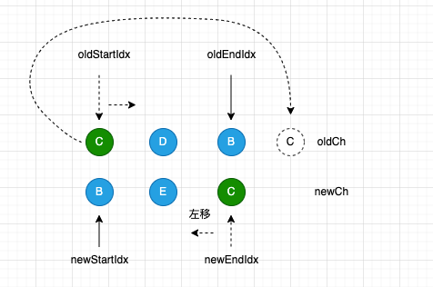
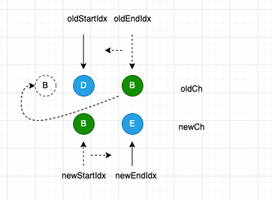
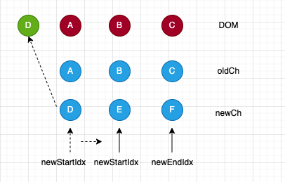
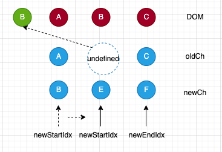
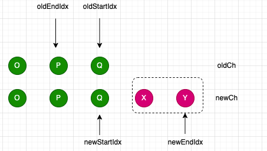
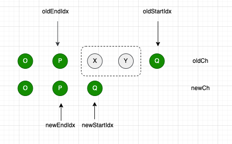

<!--
 * @Author: liangtengfeng liangtengfeng@meizu.com
 * @Date: 2022-06-14 11:23:01
 * @LastEditors: liangtengfeng liangtengfeng@meizu.com
 * @LastEditTime: 2022-06-16 19:13:33
 * @FilePath: /vue2/demo/patch2/patch2.md
 * @Description: 这是默认设置,请设置`customMade`, 打开koroFileHeader查看配置 进行设置: https://github.com/OBKoro1/koro1FileHeader/wiki/%E9%85%8D%E7%BD%AE
-->

# vue2 patch 过程（二）-- diff 算法

## 前文回顾

首先，我们先梳理一下 vue 建立的流程

1. 当我们调用`new Vue()` 时，会调用`new Watcher(vm, updateComponent)`，即是新建一个渲染 watcher
2. 首次创建渲染 watcher 时，会调用`updateComponent`,
3. 进入`updateComponent`过程，首先调用生成`vnode`的生成函数，从而得到最新的`vnode`，
4. 得到新的`vnode`之后，和旧的`vnode`，传入`patch`函数，进行“打补丁”过程，也是校对新旧节点，对节点进行增，删，改

### patch

patch 主体函数如下

```javascript
function patch(oldVnode, vnode) {
  if (isUndef(vnode)) {
    // 没有新vnode，只有旧vnode，移除节点,就会触发destory钩子
    if (isDef(oldVnode)) invokeDestroyHook(oldVnode);
    return;
  }
  // 省略...

  if (isUndef(oldVnode)) {
    // 首次渲染组件时会出现这种情况）
    // 旧vnode不存在，新vnode存在，也就是新增了节点
    createElm(vnode, insertedVnodeQueue);
  } else {
    // 新旧节点都存在的情况

    const isRealElement = isDef(oldVnode.nodeType);
    if (!isRealElement && sameVnode(oldVnode, vnode)) {
      // 不是元素节点并且新vnode跟oldNode相等，表示是修改，去做对比
      // patch existing root node
      patchVnode(oldVnode, vnode, insertedVnodeQueue, null, null, removeOnly);
    } else {
      if (isRealElement) {
        // 创建一个空vnode替代真正的dom节点
        oldVnode = emptyNodeAt(oldVnode);
      }

      // replacing existing element
      // 旧vnode的真正元素节点
      const oldElm = oldVnode.elm;
      // 旧vnode的父节点
      const parentElm = nodeOps.parentNode(oldElm);
      // 通过虚拟节点创建真实的元素并插入到它的父节点中
      // create new node
      createElm(
        vnode,
        insertedVnodeQueue,
        // extremely rare edge case: do not insert if old element is in a
        // leaving transition. Only happens when combining transition +
        // keep-alive + HOCs. (#4590)
        oldElm._leaveCb ? null : parentElm,
        nodeOps.nextSibling(oldElm)
      );
      // 省略销毁oldVnode
    }
  }
}
```

我们操作 dom 无非就是增，删，改，那其实`patch`过程也是跟这三种情况有关系，主要分为这几种情况处理

- 新节点不存在，旧节点存在，代表要`移除`;
- 新节点存在，旧节点不存在，代表要`新增`;
- 新旧节点存在，旧节点不是真实元素且新旧节点是同个节点，代表要`修改`；
- 新旧节点都存在，旧节点是真实元素，这种情况一般是初始化渲染，旧节点是容器元素的 dom`<div id="app"></div>`;

移除，新增，上次分享也提及过，本次主要是讲解`修改`，`patchVnode`过程，也即是我们平常所说的`diff`算法

## diff 过程

### patchVnode

我们从`patch`知道，新旧节点相同才会调用`patchVnode`，我们必须知道这里的`sameVnode(oldVnode, vnode)`相同，并不是完全的一模一样，不包括`children`的，sameVnode 主要依赖`key`,`tag`,`data`等属性来区分。

所以 patchVnode 的作用很明显了，就是处理 children 的，具体是内容是什么，让我们先看看函数的主流程

```javascript
function patchVnode() {
  // 新旧vnode 引用相等，直接返回
  if (oldVnode === vnode) {
    return;
  }

  // ... 省略

  if (isUndef(vnode.text)) {
    // 非文本节点
    if (isDef(oldCh) && isDef(ch)) {
      // 旧vnode与新vnode都有children,并且不相等
      if (oldCh !== ch)
        updateChildren(elm, oldCh, ch, insertedVnodeQueue, removeOnly);
    } else if (isDef(ch)) {
      // 新vnode存在children，旧vnode没有children
      if (process.env.NODE_ENV !== "production") {
        checkDuplicateKeys(ch);
      }
      // 旧vnode是文本节点，直接清空文本
      if (isDef(oldVnode.text)) nodeOps.setTextContent(elm, "");
      // 新增节点
      addVnodes(elm, null, ch, 0, ch.length - 1, insertedVnodeQueue);
    } else if (isDef(oldCh)) {
      // 新vnode不存在children, 旧vnode存在children
      // 移除所有旧vnode的children
      removeVnodes(oldCh, 0, oldCh.length - 1);
    } else if (isDef(oldVnode.text)) {
      // 旧vnode是文本节点,就清空文本
      nodeOps.setTextContent(elm, "");
    }
  } else if (oldVnode.text !== vnode.text) {
    // 文本节点，直接替换文本内容
    nodeOps.setTextContent(elm, vnode.text);
  }

  // ... 省略
}
```

#### vnode 是文本节点

文本节点

```javascript
  {
    tag: undefined
    text: " hello ",
    isStatic: false
    ...// 省略
  }
```

遇到新节点是文本，只需判断是否发生变化，发生变化直接在 DOM 上修改文本内容

```javascript
if (isUndef(vnode.text)) {
  // ...
} else if (oldVnode.text !== vnode.text) {
  // 文本节点，直接替换文本内容
  nodeOps.setTextContent(elm, vnode.text);
}
```

从代码可以看出，分两种情况

1. 是非文本节点
2. 是文本节点且新旧节点不等

#### vnode 不是文本节点

```javascript
  {
    tag: 'div',
    text: undefined,
    chidlren: [Vnode,Vnode]
  }
```

当 vnode 不是文本节点时，有以下几种情况

```javascript
if (isUndef(vnode.text)) {
  // 非文本节点
  if (isDef(oldCh) && isDef(ch)) {
    // 旧vnode与新vnode都有children,并且不相等
    if (oldCh !== ch)
      updateChildren(elm, oldCh, ch, insertedVnodeQueue, removeOnly);
  } else if (isDef(ch)) {
    // 新vnode存在children，旧vnode没有children
    if (process.env.NODE_ENV !== "production") {
      checkDuplicateKeys(ch);
    }
    // 旧vnode是文本节点，直接清空文本
    if (isDef(oldVnode.text)) nodeOps.setTextContent(elm, "");
    // 新增节点
    addVnodes(elm, null, ch, 0, ch.length - 1, insertedVnodeQueue);
  } else if (isDef(oldCh)) {
    // 新vnode不存在children, 旧vnode存在children
    // 移除所有旧vnode的children
    removeVnodes(oldCh, 0, oldCh.length - 1);
  } else if (isDef(oldVnode.text)) {
    // 旧vnode是文本节点,就清空文本
    nodeOps.setTextContent(elm, "");
  }
} else if (oldVnode.text !== vnode.text) {
  // ....
}
```

可以看出来，有几种情况

1. 新旧节点都有 children
2. 新节点有 children,旧节点没有
3. 旧节点有 children,新节点没有
4. 新旧节点都没有 children，而且旧节点是文本节点

5. 新节点有 children,旧节点没有

很明显这种情况就是新增节点，让我们看看它的处理方式

```javascript
else if (isDef(ch)) {
  // 旧vnode是文本节点，直接清空文本
  if (isDef(oldVnode.text)) nodeOps.setTextContent(elm, "");
  // 新增节点
  addVnodes(elm, null, ch, 0, ch.length - 1, insertedVnodeQueue);
}
```

如果旧节点是文本节点，先对其置空，然后调用`addVnodes`来创建新的节点

2. 旧节点有 children,新节点没有

那既然有新增，那肯定有删除的时候，那到底什么时候会删除呢，那就是"旧有新无“的情况

```javascript
 else if (isDef(oldCh)) {
      // 新vnode不存在children, 旧vnode存在children
      // 移除所有旧vnode的children
      removeVnodes(oldCh, 0, oldCh.length - 1);
    }
```

代码很短，直接调用`removeVnodes`对 children 整个进行移除，从 0 到最后一个节点

3. 都没有 children，新节点不是文本，旧节点是文本节点

```html
<!-- 旧 -->
<h5>hello</h5>
<!-- 新 -->
<h5></h5>
```

```javascript
  {
    tag: 'h5',
    children: undefined,
    text: 'hello'
  }
  {
    tag: 'h5',
    children: undefined,
    text: undefined
  }
```

很明显，原先有的文本，现在没有了，那肯定要删除了。

4. 新旧节点都有 children

当出现新旧节点都存在 children 时，若引用不一样，就会调用`updateChildren`,
从名字可以猜出来，这个函数是用来出来 vnode 的 children 的

```javascript
if (isDef(oldCh) && isDef(ch)) {
  // 旧vnode与新vnode都有children,并且不相等
  if (oldCh !== ch)
    updateChildren(elm, oldCh, ch, insertedVnodeQueue, removeOnly);
}
```

如果新旧 children 引用不一致，执行更新子节点的逻辑

### updateChildren

这个函数就对新旧 children 进行 diff，处理逻辑可以大概理解为有相同的节点对其进行移动，如果新有旧没有，就代表要新增，反之则就是删除

diff 的算法其实有三种，有优先级

1. 快捷查找
   通过创建四个指针，分别指向新旧节点的第一个节点(新头，旧头)，以及新旧节点的最后一个节点（旧尾，新尾），遵循以下的策略来查找
   - 对比新头与旧头是否相等，若相等则对应的两个指针++，
   - 对比旧尾与旧尾是否相等，若相等则对应的两个指针--;
   - 对比旧尾与新头是否相等，若相等旧尾的指针--，新头的指针++；
   - 对比旧头与新尾是否相等，若相等旧头的指针++，新尾的指针++；
2. 通过 key 值查找
   - 快捷方式找不到的话，就会把旧 children 当前剩余没有匹配的节点根据 key 创建一个 map 表，把 key 跟 index 值关联起来。
3. 循环遍历
   - 如果没有 key 值，那么就不会出现在 map 表上来，因为 map 表记录的是 key 与 index 之间的关系,只能通过遍历旧 children 来寻找新头节点。

简单地看比较逻辑方式

```html
1. 新头 == 旧头 2. 新尾 == 旧尾 3. 旧头 == 新尾 4. 旧尾 == 新头 5. 其他寻找方式
```

```javascript
function updateChildren(
  parentElm,
  oldCh,
  newCh,
  insertedVnodeQueue,
  removeOnly
) {
  // 1.先通过快捷查找
  // 2.快捷查看查找不到，就通过key值查找
  let oldStartIdx = 0; // 旧开始下标
  let newStartIdx = 0; // 新开始下标
  let oldEndIdx = oldCh.length - 1; // 旧结束下标
  let oldStartVnode = oldCh[0]; // 旧开始vnode
  let oldEndVnode = oldCh[oldEndIdx]; // 旧结束vnode
  let newEndIdx = newCh.length - 1; // 新结束下标
  let newStartVnode = newCh[0]; // 新开始vnode
  let newEndVnode = newCh[newEndIdx]; // 新结束vnode
  let oldKeyToIdx, idxInOld, vnodeToMove, refElm;
  // oldKeyToIdx 用于通过key查找的方式，是个map，key值为vnode.key,value为vnode在oldCh的序号，用来通过key值查找的

  // removeOnly is a special flag used only by <transition-group>
  // to ensure removed elements stay in correct relative positions
  // during leaving transitions
  const canMove = !removeOnly;

  if (process.env.NODE_ENV !== "production") {
    checkDuplicateKeys(newCh);
  }
  // 只有 旧开下标小于等于旧结束下标 并且 新开下标少于等于新结束下标
  while (oldStartIdx <= oldEndIdx && newStartIdx <= newEndIdx) {
    if (isUndef(oldStartVnode)) {
      // 跳过因位移导致undefine
      oldStartVnode = oldCh[++oldStartIdx]; // Vnode has been moved left
    } else if (isUndef(oldEndVnode)) {
      // 跳过因位移导致undefine
      oldEndVnode = oldCh[--oldEndIdx];
    } else if (sameVnode(oldStartVnode, newStartVnode)) {
      // 对比新第一个与旧第一个
      patchVnode(
        oldStartVnode,
        newStartVnode,
        insertedVnodeQueue,
        newCh,
        newStartIdx
      );
      oldStartVnode = oldCh[++oldStartIdx]; // 旧第一节点和下标重新标记右移
      newStartVnode = newCh[++newStartIdx]; // 新第一节点和下标重新标记右移
    } else if (sameVnode(oldEndVnode, newEndVnode)) {
      // 对比旧最后与新最后
      patchVnode(
        oldEndVnode,
        newEndVnode,
        insertedVnodeQueue,
        newCh,
        newEndIdx
      );
      oldEndVnode = oldCh[--oldEndIdx]; // 旧最后节点和下标重新左移
      newEndVnode = newCh[--newEndIdx]; // 新最后节点和下标重新左移
    } else if (sameVnode(oldStartVnode, newEndVnode)) {
      // Vnode moved right  // 对比 新最后与旧第一
      patchVnode(
        oldStartVnode,
        newEndVnode,
        insertedVnodeQueue,
        newCh,
        newEndIdx
      );
      // 在旧第一个插在旧最后之后
      canMove &&
        nodeOps.insertBefore(
          parentElm,
          oldStartVnode.elm,
          nodeOps.nextSibling(oldEndVnode.elm)
        );
      oldStartVnode = oldCh[++oldStartIdx]; // 旧第一个节点和下标重新右移
      newEndVnode = newCh[--newEndIdx]; // 新结束节点和下标重新左移
    } else if (sameVnode(oldEndVnode, newStartVnode)) {
      // Vnode moved left  对比旧最后节点和新第一个节点
      patchVnode(
        oldEndVnode,
        newStartVnode,
        insertedVnodeQueue,
        newCh,
        newStartIdx
      );
      // 将旧最后一个节点插在旧第一个节点之前
      canMove &&
        nodeOps.insertBefore(parentElm, oldEndVnode.elm, oldStartVnode.elm);
      oldEndVnode = oldCh[--oldEndIdx]; // 旧结束节点和下标左移
      newStartVnode = newCh[++newStartIdx]; // 新第一个节点和下标右移
    } else {
      // 上面快捷查找失败
      if (isUndef(oldKeyToIdx))
        oldKeyToIdx = createKeyToOldIdx(oldCh, oldStartIdx, oldEndIdx);
      // 有key值就通过key查找，没有就遍历oldCh，通过sameVnode来匹对
      idxInOld = isDef(newStartVnode.key)
        ? oldKeyToIdx[newStartVnode.key]
        : findIdxInOld(newStartVnode, oldCh, oldStartIdx, oldEndIdx);
      if (isUndef(idxInOld)) {
        // New element 旧ch都没有，代表是新增的
        createElm(
          newStartVnode,
          insertedVnodeQueue,
          parentElm,
          oldStartVnode.elm,
          false,
          newCh,
          newStartIdx
        );
      } else {
        // 找到了
        vnodeToMove = oldCh[idxInOld];
        // 进一步判断vnodeToMove ，newStartVnode是否为同一个vnode
        // 通过map表查询的vnode没有校验通过sameVnode校验，故这里加上
        if (sameVnode(vnodeToMove, newStartVnode)) {
          patchVnode(
            vnodeToMove,
            newStartVnode,
            insertedVnodeQueue,
            newCh,
            newStartIdx
          );
          oldCh[idxInOld] = undefined; // 被移动的vnode坑位设为undefine
          // 被移动旧第一个节点之前
          canMove &&
            nodeOps.insertBefore(parentElm, vnodeToMove.elm, oldStartVnode.elm);
        } else {
          // 相同的key，但其他不相等也当做是新增
          // same key but different element. treat as new element
          createElm(
            newStartVnode,
            insertedVnodeQueue,
            parentElm,
            oldStartVnode.elm,
            false,
            newCh,
            newStartIdx
          );
        }
      }
      newStartVnode = newCh[++newStartIdx];
    }
  }
  if (oldStartIdx > oldEndIdx) {
    // 旧的移动完了，新的可能还没移动完。
    refElm = isUndef(newCh[newEndIdx + 1]) ? null : newCh[newEndIdx + 1].elm;
    addVnodes(
      parentElm,
      refElm,
      newCh,
      newStartIdx,
      newEndIdx,
      insertedVnodeQueue
    );
  } else if (newStartIdx > newEndIdx) {
    removeVnodes(oldCh, oldStartIdx, oldEndIdx);
  }
}
```

先看看这八个变量，四个指针，分别指向新旧头，新旧尾，还有四个变量分是指针指向的节点

```javascript
let oldStartIdx = 0; // 旧开始下标
let newStartIdx = 0; // 新开始下标
let oldEndIdx = oldCh.length - 1; // 旧结束下标
let oldStartVnode = oldCh[0]; // 旧开始vnode
let oldEndVnode = oldCh[oldEndIdx]; // 旧结束vnode
let newEndIdx = newCh.length - 1; // 新结束下标
let newStartVnode = newCh[0]; // 新开始vnode
let newEndVnode = newCh[newEndIdx]; // 新结束vnode
```

以两边向中间靠拢的方式来遍历，直到新旧 children 任一个遍历完就结束，然后处理剩余的节点

#### 新头 == 旧头

```javascript
if (sameVnode(oldStartVnode, newStartVnode)) {
  // 对比新第一个与旧第一个
  patchVnode(
    oldStartVnode,
    newStartVnode,
    insertedVnodeQueue,
    newCh,
    newStartIdx
  );
  oldStartVnode = oldCh[++oldStartIdx]; // 旧第一节点和下标重新标记右移
  newStartVnode = newCh[++newStartIdx]; // 新第一节点和下标重新标记右移
}
```



符合条件的新旧头对应的指针就会+1，并且重新给新旧头赋值，因为指针变化了。
调用`patchVnode`，比较新旧节点有什么变化采取对应的措施

#### 新尾 == 旧尾

```javascript
if (sameVnode(oldEndVnode, newEndVnode)) {
  // 对比旧最后与新最后
  patchVnode(oldEndVnode, newEndVnode, insertedVnodeQueue, newCh, newEndIdx);
  oldEndVnode = oldCh[--oldEndIdx]; // 旧最后节点和下标重新左移
  newEndVnode = newCh[--newEndIdx]; // 新最后节点和下标重新左移
}
```



新旧尾的指针都-1，向中间靠拢

#### 新尾 == 旧头

```javascript
if (sameVnode(oldStartVnode, newEndVnode)) {
  // Vnode moved right  // 对比 新最后与旧第一
  patchVnode(oldStartVnode, newEndVnode, insertedVnodeQueue, newCh, newEndIdx);
  // 在旧第一个插在旧最后之后
  canMove &&
    nodeOps.insertBefore(
      parentElm,
      oldStartVnode.elm,
      nodeOps.nextSibling(oldEndVnode.elm)
    );
  oldStartVnode = oldCh[++oldStartIdx]; // 旧第一个节点和下标重新右移
  newEndVnode = newCh[--newEndIdx]; // 新结束节点和下标重新左移
}
```



把旧头直接插在旧后最后一个元素前面，新尾指针--，旧头指针++

#### 新头 == 旧尾

```javascript
if (sameVnode(oldEndVnode, newStartVnode)) {
  // Vnode moved left  对比旧最后节点和新第一个节点
  patchVnode(
    oldEndVnode,
    newStartVnode,
    insertedVnodeQueue,
    newCh,
    newStartIdx
  );
  // 将旧最后一个节点插在旧第一个节点之前
  canMove &&
    nodeOps.insertBefore(parentElm, oldEndVnode.elm, oldStartVnode.elm);
  oldEndVnode = oldCh[--oldEndIdx]; // 旧结束节点和下标左移
  newStartVnode = newCh[++newStartIdx]; // 新第一个节点和下标右移
}
```



旧尾指针--，新头指针++，并且把旧尾节点插在旧头之前

#### 其他查找方式

上面的快捷查找都没找到的话，就会进入其他查找方式

```javascript
// 上面快捷查找失败
if (isUndef(oldKeyToIdx))
  oldKeyToIdx = createKeyToOldIdx(oldCh, oldStartIdx, oldEndIdx);
// 有key值就通过key查找，没有就遍历oldCh，通过sameVnode来匹对
idxInOld = isDef(newStartVnode.key)
  ? oldKeyToIdx[newStartVnode.key]
  : findIdxInOld(newStartVnode, oldCh, oldStartIdx, oldEndIdx);
```

首次进入没有 map 表，就创建 map 表，来记录 key 与 index 直接的关系

- 如果新头节点存在 key 值，就会去 map 表查询其 index
- 新头节点不在 key 值，`findIdxInOld`遍历剩余的旧 children 去查询其 index

假如 oldch 结构如下

```javascript
[
  {
    tag: "li",
    key: "3",
  },
  {
    tag: "li",
    key: "4",
  },
  {
    tag: "li",
    key: "2",
  },
  {
    tag: "li",
    key: "1",
  },
];
```

map 表如下

```javascript
  {
    "3": 0,
    "4": 1,
    "2": 2,
    "1": 3
  }
```

key 为 2 的值，所在数组第 2 位

```javascript
if (isUndef(idxInOld)) {
  // New element 旧ch都没有，代表是新增的
  createElm(
    newStartVnode,
    insertedVnodeQueue,
    parentElm,
    oldStartVnode.elm,
    false,
    newCh,
    newStartIdx
  );
} else {
  // 找到了
  vnodeToMove = oldCh[idxInOld];
  // 进一步判断vnodeToMove ，newStartVnode是否为同一个vnode
  // 通过map表查询的vnode没有校验通过sameVnode校验，故这里加上
  if (sameVnode(vnodeToMove, newStartVnode)) {
    patchVnode(
      vnodeToMove,
      newStartVnode,
      insertedVnodeQueue,
      newCh,
      newStartIdx
    );
    oldCh[idxInOld] = undefined; // 被移动的vnode坑位设为undefine
    // 被移动旧第一个节点之前
    canMove &&
      nodeOps.insertBefore(parentElm, vnodeToMove.elm, oldStartVnode.elm);
  } else {
    // 相同的key，但其他不相等也当做是新增
    // same key but different element. treat as new element
    createElm(
      newStartVnode,
      insertedVnodeQueue,
      parentElm,
      oldStartVnode.elm,
      false,
      newCh,
      newStartIdx
    );
  }
}
newStartVnode = newCh[++newStartIdx];
```

1. 不在旧子节点组里面
   那代表这个新头节点是新增的，那就调用`createElm`在旧头前创建新的节点

;

2. 在旧子节点组里面

- 如果是同个节点，目标节点的坑位被置为 undefined（某轮循环遇到 undefined 会直接跳过改节点），移动节点到旧头前
  ;
- 如果不是同个节点，直接调用`createElm`在旧头前创建新节点（同 1）

#### 处理剩余节点

```javascript
if (oldStartIdx > oldEndIdx) {
  // 旧的移动完了，新的可能还没移动完,需要一个节点来定位，新增的节点到底插在哪之前
  refElm = isUndef(newCh[newEndIdx + 1]) ? null : newCh[newEndIdx + 1].elm;
  addVnodes(
    parentElm,
    refElm,
    newCh,
    newStartIdx,
    newEndIdx,
    insertedVnodeQueue
  );
} else if (newStartIdx > newEndIdx) {
  removeVnodes(oldCh, oldStartIdx, oldEndIdx);
}
```

我们知道跳出 while 的条件是，旧 children 或者新旧 children 遍历完，
所以跳出 while 之后，存在以下可能

- 新旧 children 都遍历完
  无事发生，不需要另外处理
- 旧children遍历完，新children有剩余
  把新children剩余没有遍历的节点，通过`addVnodes`来创建节点
  ;

- 新 children 遍历完，旧children有剩余
  调用`removeVnodes`移除多余节点
  ;
