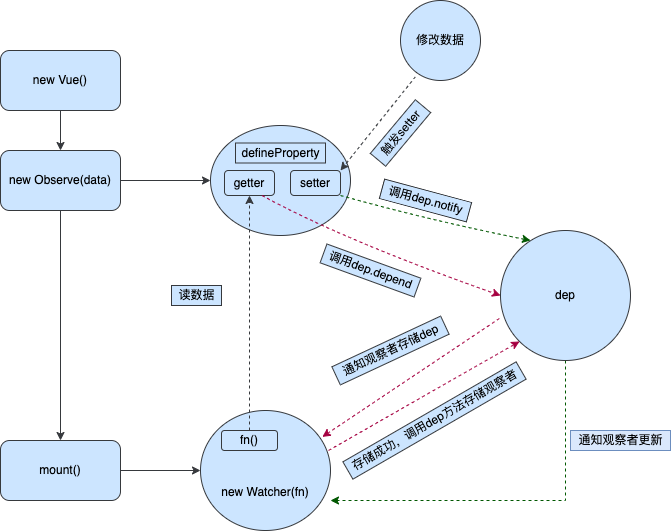
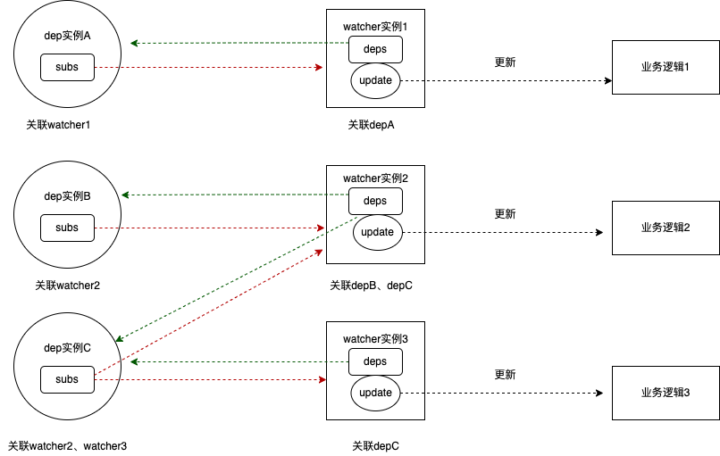

# 响应式原理
响应式原理，简而言之就是数据驱动更新，数据发生变化后，页面重新渲染，想实现这个目的，需要以下三个步骤 

1.监听数据变化 

2.收集视图层依赖了那些数据 

3.数据变化，通知视图层更新 

响应式流程图 



## data响应式数据初始化

### initData
`initData`在`initState`方法体,源码在 `src/core/instance`路径下
```javascript
function initData (vm: Component) {
  let data = vm.$options.data
  // 调用getData 防止触发getter收集依赖
  data = vm._data = typeof data === 'function'
    ? getData(data, vm)
    : data || {}
  if (!isPlainObject(data)) {
    data = {}
    process.env.NODE_ENV !== 'production' && warn(
      'data functions should return an object:\n' +
      'https://vuejs.org/v2/guide/components.html#data-Must-Be-a-Function',
      vm
    )
  }
  // proxy data on instance
  const keys = Object.keys(data)
  const props = vm.$options.props
  const methods = vm.$options.methods
  let i = keys.length
  while (i--) {
    const key = keys[i]
    // data上的key不能与methods上的冲突
    if (process.env.NODE_ENV !== 'production') {
      if (methods && hasOwn(methods, key)) {
        warn(
          `Method "${key}" has already been defined as a data property.`,
          vm
        )
      }
    }
    // data上的key不能与props上的冲突
    if (props && hasOwn(props, key)) {
      process.env.NODE_ENV !== 'production' && warn(
        `The data property "${key}" is already declared as a prop. ` +
        `Use prop default value instead.`,
        vm
      )
    } else if (!isReserved(key)) {
      // 代理data上的属性，可以直接用this[key]访问，实际访问的是this._data
      proxy(vm, `_data`, key)
    }
  }
  // observe data
  observe(data, true /* asRootData */)
}
```
从上面看出，`initData`看出对data上的key进行了代理，可以直接通过this[key]来访问this._data[key]上的值,最后再调用`observe(data,true)`对data进行响应式数据初始化。


### observe
`observe`方法位于`src/core/observer/index.js`下，

```javascript
export function observe (value: any, asRootData: ?boolean): Observer | void {
  // 非对象，或者是vnode对象 不进行响应式数据初始化
  if (!isObject(value) || value instanceof VNode) {
    return
  }
  let ob: Observer | void
  // 如果数据已经响应化了（有__ob__，直接指向Observer实例），直接取__ob__指向的值
  if (hasOwn(value, '__ob__') && value.__ob__ instanceof Observer) {
    ob = value.__ob__
  } else if (
    shouldObserve &&
    !isServerRendering() &&
    (Array.isArray(value) || isPlainObject(value)) &&
    Object.isExtensible(value) &&
    !value._isVue
  ) {
    /**
     * 1.可以响应性化
     * 2.非服务端渲染
     * 3.是对象或者是数组
     * 4.是可扩展的
     * 5.非vue实例
     * 满足上诉5个条件，可响应式化
     */
    ob = new Observer(value)
  }
  if (asRootData && ob) {
    // 只有value 是通过initData -> observe 进来才会进来
    // 当做标识，限制this.$set(this.$data,'key',any)，往根data新增key
    ob.vmCount++
  }
  return ob
}
```
`observe`起到的作用过滤不符合响应式条件的值，以及防止重复new Observer，具体看注释。


### Observer

这个类位于`src/core/observer/index.js`

```javascript
class Observer {
  value: any;
  dep: Dep;
  vmCount: number; // number of vms that have this object as root $data

  constructor (value: any) {
    this.value = value
    // 新增一个“匡”，用于新增，删除节点时，发送通知给watcher更新
    this.dep = new Dep()
    this.vmCount = 0
    // 定义__ob__指向自身实例，并且不可枚举
    def(value, '__ob__', this)
    if (Array.isArray(value)) {
      // 是数组就重写push，unshift等方法，对数据进行拦截，对新增数据响应性话，并且触发更新
      if (hasProto) {
        protoAugment(value, arrayMethods)
      } else {
        copyAugment(value, arrayMethods, arrayKeys)
      }
      //循环遍历数组，数组项的对象进行响应式化。
      this.observeArray(value)
    } else {
      // 对象就走这里
      this.walk(value)
    }
  }

  /**
   * Walk through all properties and convert them into
   * getter/setters. This method should only be called when
   * value type is Object.
   */
  walk (obj: Object) {
    const keys = Object.keys(obj)
    for (let i = 0; i < keys.length; i++) {
      defineReactive(obj, keys[i])
    }
  }

  /**
   * Observe a list of Array items.
   */
  observeArray (items: Array<any>) {
    for (let i = 0, l = items.length; i < l; i++) {
      observe(items[i])
    }
  }
}
```
为每个传入的对象或者数组，添加`__ob__`属性指向 Observer实例，如果是数组还对`push`,`pop`等方法进行改写，实现拦截，调用`this.__ob__.dep.notify()`触发更新，如果是对象，就调用`defineReactive`

### defineReactive 
`defineReactive` 函数的核心就是 将数据对象的数据属性转换为访问器属性，即为数据对象的属性设置一对 getter/setter
```javascript
/**
 * Define a reactive property on an Object.
 */
export function defineReactive (
  obj: Object,
  key: string,
  val: any,
  customSetter?: ?Function,
  shallow?: boolean
) {
  // 这里又创建了一个“匡”
  const dep = new Dep()
  
  // 对象不可配置，直接return
  const property = Object.getOwnPropertyDescriptor(obj, key)
  if (property && property.configurable === false) {
    return
  }
   
  // cater for pre-defined getter/setters
  const getter = property && property.get
  const setter = property && property.set
  if ((!getter || setter) && arguments.length === 2) {
    val = obj[key]
  }
  // 深度响应式，对val也进行响应式处理
  let childOb = !shallow && observe(val)

  Object.defineProperty(obj, key, {
    enumerable: true,
    configurable: true,
    get: function reactiveGetter () {
      // 获取值
      const value = getter ? getter.call(obj) : val
      // 当前targetStack（存放watcher实例）栈顶有watcher
      if (Dep.target) {
        // 通过dep通知watcher来存储dep
        dep.depend()
        if (childOb) {
          // 通过子对象的dep通知watcher来存储子对象的dep
          childOb.dep.depend()
          if (Array.isArray(value)) {
            // list:[{a:1},{a:2}] 实现 this.list[0]['a'] = 2 能触发响应,让{a:1}的dep收集watcher
            dependArray(value)
          }
        }
      }
      return value
    },
    set: function reactiveSetter (newVal) {
      console.log('setting',newVal)
      const value = getter ? getter.call(obj) : val
      // 值没变化就return
      /* eslint-disable no-self-compare */
      if (newVal === value || (newVal !== newVal && value !== value)) {
        return
      }
      /* eslint-enable no-self-compare */
      if (process.env.NODE_ENV !== 'production' && customSetter) {
        customSetter()
      }
      // #7981: for accessor properties without setter
      if (getter && !setter) return
      if (setter) {
        setter.call(obj, newVal)
      } else {
        val = newVal
      }
      //对新值进行响应式化处理
      childOb = !shallow && observe(newVal)
      // 触发依赖
      dep.notify()
    }
  })
}
```
 每一个数据字段都通过闭包引用着属于自己的 dep 常量，从上面看出，通过`dep.depend`来触发订阅
 触发响应是同个调用`dep.notify`

## 依赖收集

### Dep
`Dep`位于`src/core/observer/dep.js`下,是一个收集观察者订阅，以及通知观察更新的一个容器
```javascript
let uid = 0

/**
 * A dep is an observable that can have multiple
 * directives subscribing to it.
 */
export default class Dep {
  static target: ?Watcher; // 当前活跃的观察者
  id: number; // Dep 的唯一Id
  subs: Array<Watcher>; // 与watcher一对多的关系映射

  constructor () {
    this.id = uid++
    this.subs = []
  }
  // 添加watcher
  addSub (sub: Watcher) {
    this.subs.push(sub)
  }
  // 移除watcher
  removeSub (sub: Watcher) {
    remove(this.subs, sub)
  }
  // 通知watcher收集我
  depend () {
    if (Dep.target) {
      Dep.target.addDep(this)
    }
  }
  // 通知watcher触发更新
  notify () {
    // stabilize the subscriber list first
    const subs = this.subs.slice()
    if (process.env.NODE_ENV !== 'production' && !config.async) {
      // subs aren't sorted in scheduler if not running async
      // we need to sort them now to make sure they fire in correct
      // order
      // 同步更新时，对watcher进行排列
      subs.sort((a, b) => a.id - b.id)
    }
    for (let i = 0, l = subs.length; i < l; i++) {
      subs[i].update()
    }
  }
}

// The current target watcher being evaluated.
// This is globally unique because only one watcher
// can be evaluated at a time.

// 记录栈顶观察者
Dep.target = null
// 观察者栈
const targetStack = []

// 推入栈
export function pushTarget (target: ?Watcher) {
  targetStack.push(target)
  Dep.target = target
}

// 推出栈
export function popTarget () {
  targetStack.pop()
  Dep.target = targetStack[targetStack.length - 1]
}

```
通过`depend`通知观察者添加`dep`实例，之后观察者先通过判断原先是否已经建立存储关系，如果已经建立就不再添加，反之则添加。
通过`notify`方法，遍历建立关系的观察数组`sub`来通知观察者更新。
从上面可以看出`sub`的添加或者删除观察者都是暴露出给观察者调用的，内部没有任何添加与删除的操作，说明`dep`与观察者的关系是由
观察者决定的。

## Watch
`Watcher`这个类位于`src/core/observer/watcher.js`
```javascript
export default class Watcher {
  vm: Component; //当前实例
  expression: string; // 监听属性的字符串
  cb: Function; // 数据发生变动执行的回调
  id: number; // 每个watcher的唯一id
  deep: boolean; // 深度监测
  user: boolean; // 属于使用者自己new的watcher
  lazy: boolean; // computed专用
  sync: boolean; // 是否同步更新
  dirty: boolean; // computed专用，规避多次求值
  active: boolean; // 是否失去活性
  deps: Array<Dep>; // 记录上一次收集的dep，一个watcher对应N个dep
  newDeps: Array<Dep>; // 记录最新收集的dep,一个watcher对应N个dep
  depIds: SimpleSet; // Set
  newDepIds: SimpleSet; // Set
  before: ?Function; // 更新之前的回调
  getter: Function; // 产生订阅的函数
  value: any; // 监听属性的值

  constructor (
    vm: Component,
    expOrFn: string | Function,
    cb: Function,
    options?: ?Object,
    isRenderWatcher?: boolean
  ) {
    this.vm = vm
    if (isRenderWatcher) {
      //是渲染watcher，就给实例添加_watcher
      vm._watcher = this
    }
    vm._watchers.push(this)
    // options
    if (options) {
      this.deep = !!options.deep
      this.user = !!options.user
      this.lazy = !!options.lazy
      this.sync = !!options.sync
      this.before = options.before
    } else {
      this.deep = this.user = this.lazy = this.sync = false
    }
    this.cb = cb
    this.id = ++uid // uid for batching
    this.active = true
    this.dirty = this.lazy // for lazy watchers
    this.deps = []
    this.newDeps = []
    this.depIds = new Set()
    this.newDepIds = new Set()
    this.expression = process.env.NODE_ENV !== 'production'
      ? expOrFn.toString()
      : ''
    // parse expression for getter
    if (typeof expOrFn === 'function') {
      this.getter = expOrFn
    } else {
      // 如果expOrFn是字符串，就包装为一个函数
      this.getter = parsePath(expOrFn)
      if (!this.getter) {
        this.getter = noop
        process.env.NODE_ENV !== 'production' && warn(
          `Failed watching path: "${expOrFn}" ` +
          'Watcher only accepts simple dot-delimited paths. ' +
          'For full control, use a function instead.',
          vm
        )
      }
    }
    this.value = this.lazy
      ? undefined
      : this.get()
  }

  /**
   * Evaluate the getter, and re-collect dependencies.
   */
  get () {
    //把实例推进栈顶，即Dep.target = this
    pushTarget(this)
    let value
    const vm = this.vm
    try {
      // 调用产生订阅的函数
      value = this.getter.call(vm, vm)
    } catch (e) {
      if (this.user) {
        handleError(e, vm, `getter for watcher "${this.expression}"`)
      } else {
        throw e
      }
    } finally {
      // "touch" every property so they are all tracked as
      // dependencies for deep watching
      if (this.deep) {
        // 深度监听
        traverse(value)
      }
      // 把实例推出栈
      popTarget()
      this.cleanupDeps()
    }
    return value
  }

  /**
   * Add a dependency to this directive.
   */
  addDep (dep: Dep) {
    const id = dep.id
    // 一次求值 的过程中收集重复的依赖
    if (!this.newDepIds.has(id)) {
      this.newDepIds.add(id)
      this.newDeps.push(dep)
      // 检测dep身上有没有记录当前watcher，没有就添加
      if (!this.depIds.has(id)) {
        dep.addSub(this)
      }
    }
  }

  /**
   * Clean up for dependency collection.
   */
  cleanupDeps () {
    let i = this.deps.length
    while (i--) {
      const dep = this.deps[i]
      // 将不关联的dep的移除watcher
      if (!this.newDepIds.has(dep.id)) {
        dep.removeSub(this)
      }
    }
    // 把newDepIds、newDeps的值赋给deps，depIds，并置空自己
    let tmp = this.depIds
    this.depIds = this.newDepIds
    this.newDepIds = tmp
    this.newDepIds.clear()
    tmp = this.deps
    this.deps = this.newDeps
    this.newDeps = tmp
    this.newDeps.length = 0
  }

  /**
   * Subscriber interface.
   * Will be called when a dependency changes.
   */
  update () {
    /* istanbul ignore else */
    if (this.lazy) {
      // computer专用
      this.dirty = true
    } else if (this.sync) {
      // 同步更新
      this.run()
    } else {
      // 异步更新
      queueWatcher(this)
    }
  }

  /**
   * Scheduler job interface.
   * Will be called by the scheduler.
   */
  run () {
    if (this.active) {
      const value = this.get()
      // 1.新旧值不相等； 2.是个对象 ; 3.深度检测
      if (
        value !== this.value ||
        // Deep watchers and watchers on Object/Arrays should fire even
        // when the value is the same, because the value may
        // have mutated.
        isObject(value) ||
        this.deep
      ) {
        // set new value
        const oldValue = this.value
        this.value = value
        //用户定义的watcher添加捕捉错误逻辑
        if (this.user) {
          const info = `callback for watcher "${this.expression}"`
          invokeWithErrorHandling(this.cb, this.vm, [value, oldValue], this.vm, info)
        } else {
          this.cb.call(this.vm, value, oldValue)
        }
      }
    }
  }

  /**
   * Evaluate the value of the watcher.
   * This only gets called for lazy watchers.
   */
  evaluate () {
    // 给computer求值用的
    this.value = this.get()
    this.dirty = false
  }

  /**
   * Depend on all deps collected by this watcher.
   */
  depend () {
    let i = this.deps.length
    while (i--) {
      //让栈顶wather收集本watcher的deps
      this.deps[i].depend()
    }
  }

  /**
   * Remove self from all dependencies' subscriber list.
   */
  teardown () {
    if (this.active) {
      // remove self from vm's watcher list
      // this is a somewhat expensive operation so we skip it
      // if the vm is being destroyed.
      //如果组件没有被销毁，那么将当前观察者实例从组件实例对象的 vm._watchers 数组中移除
      if (!this.vm._isBeingDestroyed) {
        remove(this.vm._watchers, this)
      }
      // 解除dep跟观察者的关系
      let i = this.deps.length
      while (i--) {
        this.deps[i].removeSub(this)
      }
      this.active = false
    }
  }
}

```


